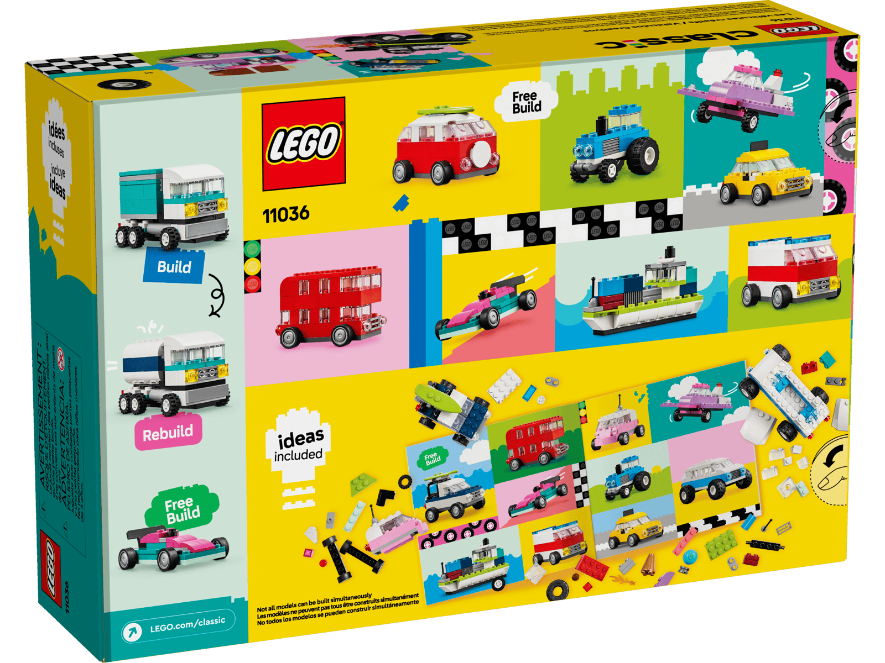

When I was kid my favorite toy was Lego. I would hold on to those mini-catalogues you’d get when buying a Lego set and dream of owning some of the larger ones, like the pirate ship or the full size castle. Sometimes my wish would come true and I’d get one, but the best part of Lego was that even if I didn’t, to some degree it was in my power to try _to make for myself_ what I saw on the page. Given access to enough of the basic blocks, I could build just about anything.

My son Conall is now old enough to start appreciating Lego and I’ve been doing everything my power to encourage that interest. In particular, there are two recent purchases I’ve made that I think are really stoking the flames for him.

## The _Creative Vehicles_ Set, From the Classic Collection

[This 900 piece set](https://www.lego.com/en-us/product/creative-vehicles-11036) gives you all you need to create cars, trucks, or other wheeled transport by including plenty of axles, tires, clear bricks for windshields and lights, etc. My son is obsessed with vehicles -- honestly, it’s 90% of what he wants to build with me -- so this really was the perfect set for him. There are instructions for some vehicles to get you started, but the set encourages you to free-form build, using the pieces however you like.

We’ve had enough hours of fun already with this set to justify the purchase, yet knowing it will continue to have life for years with all these basic bricks to build on? That really sets this set over the top. So happy with this purchase.

## The Minifigure Factory

One thing I’ve noticed with my son is that in his imaginative play he’ll use his stuffies as characters, having them play along with him. To help him feel like he could play that way with what he builds in Lego I decided to buy him a Lego version of his family.

And he loves it! So cool that [Lego offers this service now](https://www.lego.com/en-us/minifigure-factory).
